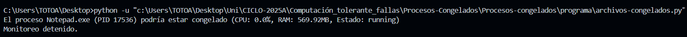

# Procesos-congelados 

# Descripción
Este script en Python monitorea los procesos en ejecución en tu computadora y detecta aquellos que podrían estar congelados (sin uso de CPU por un tiempo prolongado).  
Utiliza hilos `threading` para ejecutarse en segundo plano, asegurando que el monitoreo sea eficiente y no interfiera con el rendimiento del sistema.  

---

# Características
-Detección Automática: Identifica procesos con 30s o más sin uso de CPU.  
-Filtrado Inteligente: Ignora procesos con menos de 400MB de RAM para evitar falsos positivos.  
-Ejecución en Segundo Plano: Usa hilos `threading` para mejorar la eficiencia.  
-Historial de Uso de CPU: Mantiene un registro de los procesos en los últimos 60 segundos.  
-Detención Segura: Puede detenerse con CTRL + C sin afectar el sistema.  

---

# Evidencia de funcionamiento


# Requisitos
- Python 3.12 
- Módulo `psutil` (para obtener información de los procesos)  

# Instalación
Clona el repositorio o descarga el script:  
```bash
git clone https://github.com/AlonsoCanales-Prog/Procesos-congelados.git


